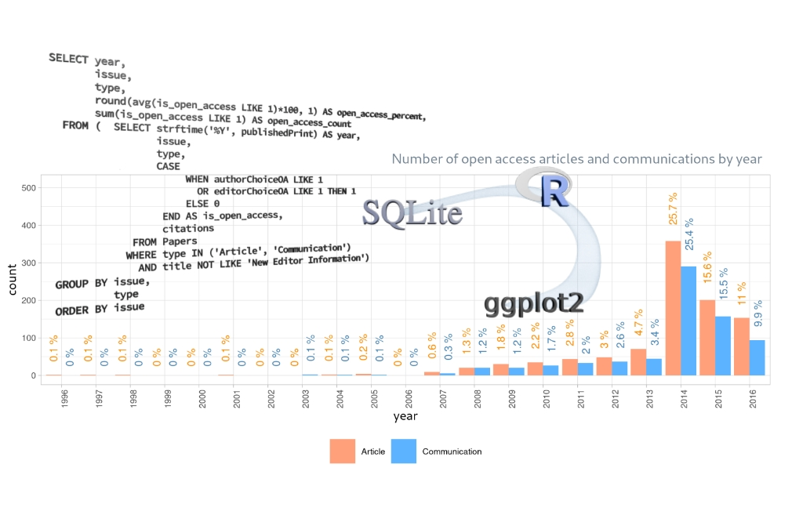

## JACS Papers database

This project contains an exploratory analysis of the **JACS Papers 1996–2016** database from ***kaggle***.

The database includes three tables and contains information about publications and authors in the Journal of the American Chemical Society (JACS) for the period from 1996 to 2016.

------------------------------------------------------------------------  

  
This project has the following form:

• A ***question*** related to journal format and citations.

• ***SQL query*** to find the answer.\
⚬ R packages, *DBI* and *RSQLite*, were used to make SQL queries;\
⚬ the queries are written on SQLite, version 3.46.1.

• ***R tools*** for visualizing results:\
⚬ all graphs were built using *ggplot2*, *ggrepel* and *ggwordcloud*, and\
⚬ the *ggpubr* and *gt* packages were used to create tables.

------------------------------------------------------------------------  

### Files

 To generate the HTML report from *JACSpapers_1996_2016.Rmd* file, you need to download the ***database.sqlite*** file from <https://www.kaggle.com/datasets/mathewsavage/jacs/data> and save it in the projects folder.
<pre>
.
├── image_JACSpapers.jpg           # image for the README file
├── index.html                     # HTML report
├── JACSpapers_1996_2016.Rmd       # Rmd file to render HTML report
├── JACSpapers.Rproj
├── LICENSE
├── README.md                      # README file
└── styles.css                     # styles for HTML report

</pre>

-------------------------------------------------------------------

### Packages
<pre>
R version 4.4.3 (2025-02-28)  

tidytext_0.4.2      gt_0.11.1           knitr_1.49        ggrepel_0.9.6    
ggwordcloud_0.6.2   ggpubr_0.6.0        ggplot2_3.5.1     RSQLite_2.3.9    
DBI_1.2.3           rmarkdown_2.29      stringr_1.5.1     dplyr_1.1.4.9000    

</pre>

